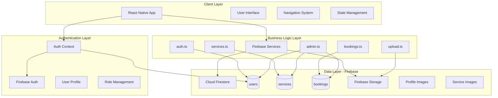
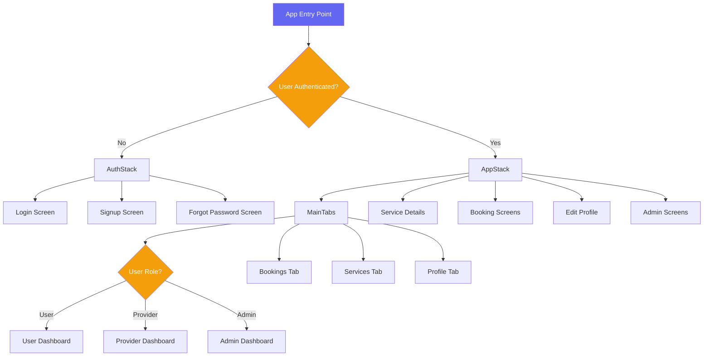
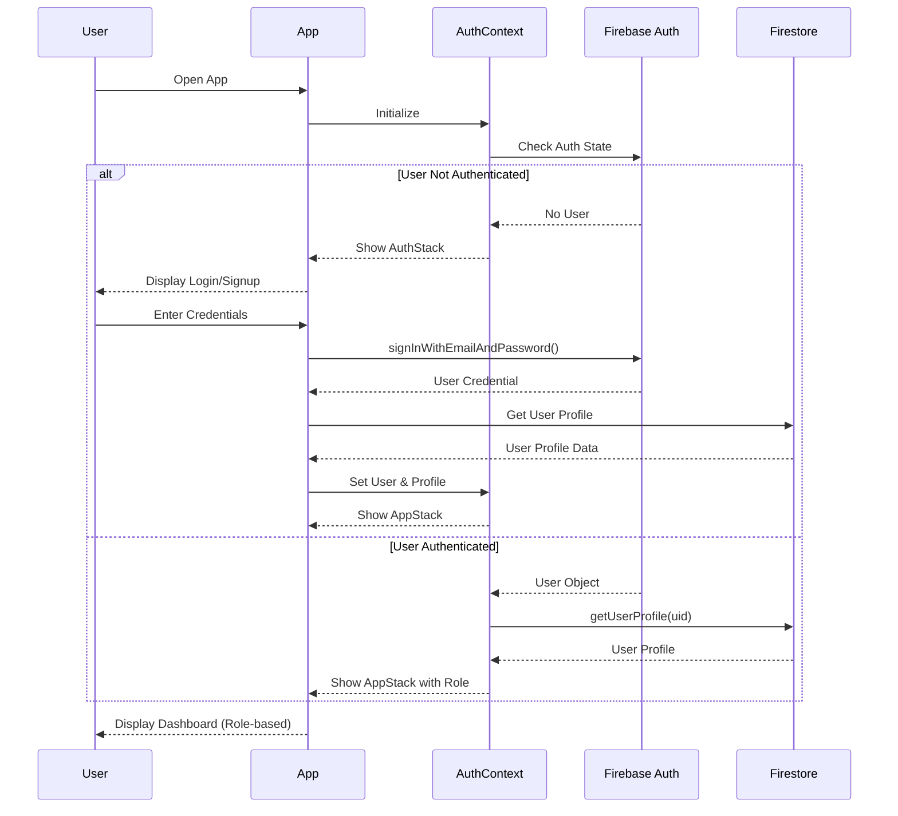
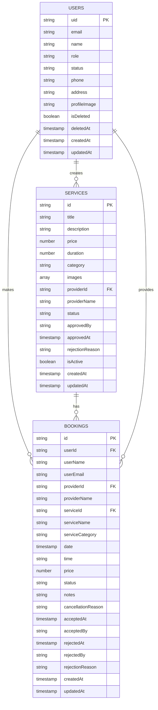
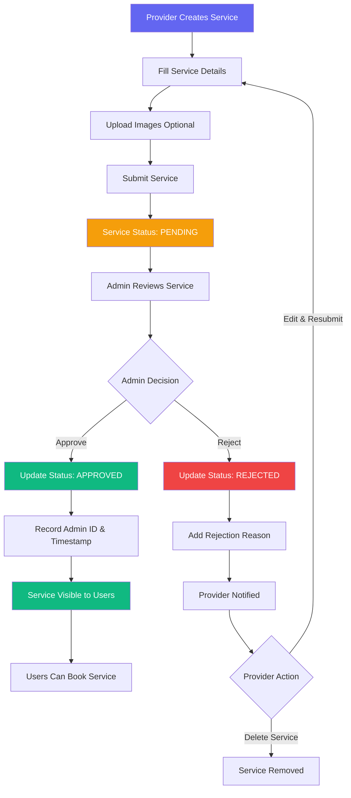
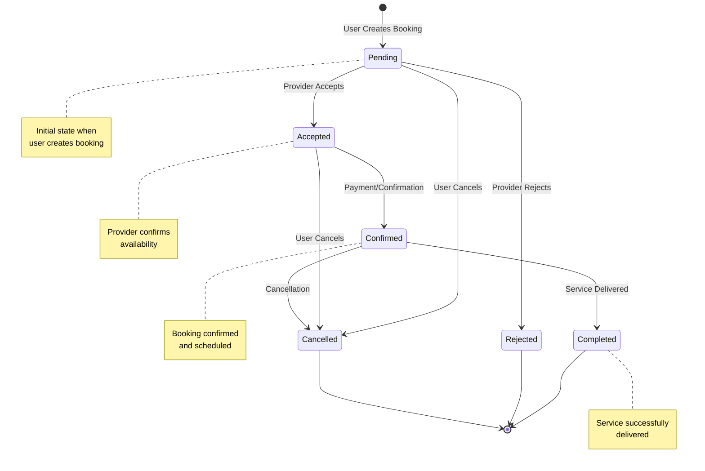
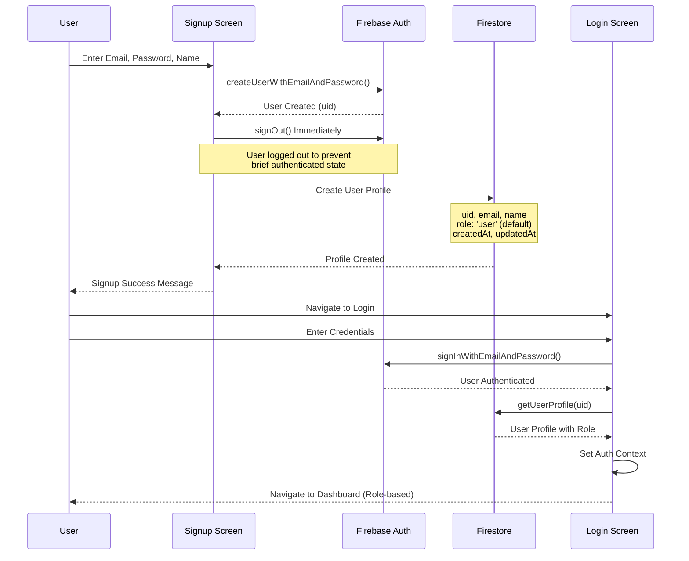
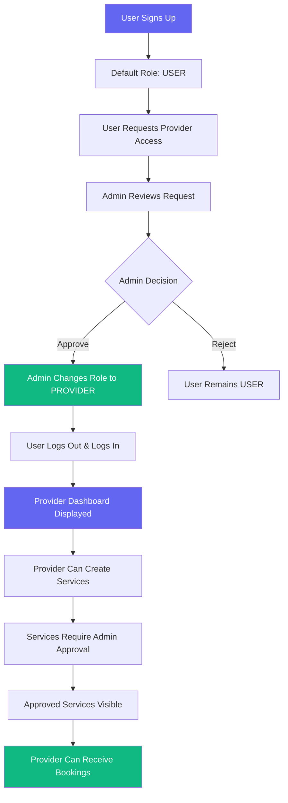
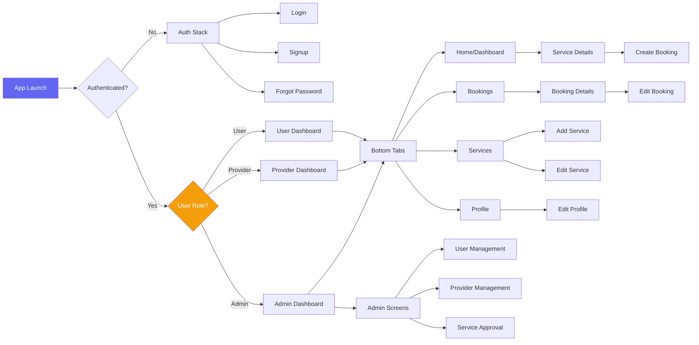

# Event Planner App - Technical Documentation

**Version:** 1.0.0  
**Last Updated:** November 27, 2025  
**Platform:** React Native (Expo)  
**Backend:** Firebase (Firestore, Authentication, Storage)

---

## Table of Contents

1. [Introduction & Overview](#1-introduction--overview)
2. [System Architecture](#2-system-architecture)
3. [Authentication & Authorization](#3-authentication--authorization)
4. [Core Features](#4-core-features)
5. [Data Models & Firebase Integration](#5-data-models--firebase-integration)
6. [Workflows & Processes](#6-workflows--processes)
7. [UI/UX Architecture](#7-uiux-architecture)
8. [Deployment & Configuration](#8-deployment--configuration)

---

## 1. Introduction & Overview

### 1.1 Purpose

The **Event Planner App** is a comprehensive mobile application designed to connect event service providers with customers who need event planning services. The platform facilitates service discovery, booking management, and provides administrative tools for platform oversight.

### 1.2 Key Features

- **Multi-Role System**: Support for three distinct user roles (Admin, Provider, User)
- **Service Management**: Providers can create and manage event services
- **Booking System**: Complete booking lifecycle from creation to completion
- **Admin Panel**: Comprehensive administrative controls and analytics
- **Real-time Updates**: Live data synchronization using Firebase
- **Service Approval Workflow**: Admin approval process for new services
- **Provider Dashboard**: Analytics and booking management for service providers

### 1.3 Technology Stack

#### Frontend
- **Framework**: React Native 0.81.5
- **Development Platform**: Expo ~54.0.25
- **Navigation**: React Navigation 7.x
  - Native Stack Navigator
  - Bottom Tabs Navigator
- **Styling**: NativeWind 4.2.1 (TailwindCSS for React Native)
- **State Management**: React Context API
- **UI Components**: Custom components with Expo Vector Icons

#### Backend & Services
- **Backend as a Service**: Firebase 12.6.0
  - **Authentication**: Firebase Auth (Email/Password)
  - **Database**: Cloud Firestore (NoSQL)
  - **Storage**: Firebase Storage (for images)
- **Real-time Data**: Firestore real-time listeners

#### Development Tools
- **Language**: TypeScript 5.9.2
- **Package Manager**: npm
- **Linting**: ESLint with Expo config
- **Code Formatting**: Prettier with TailwindCSS plugin

### 1.4 Target Users

1. **Regular Users (Customers)**
   - Browse and search event services
   - Create and manage bookings
   - View booking history
   - Update profile information

2. **Service Providers**
   - Create and manage services
   - Accept/reject booking requests
   - View earnings and analytics
   - Manage booking schedule

3. **Administrators**
   - Approve/reject service submissions
   - Manage users and providers
   - View platform analytics
   - Monitor system activity

---

## 2. System Architecture

### 2.1 High-Level Architecture



### 2.2 Project Structure

```
Event-Planner-App/
├── src/
│   ├── components/          # Reusable UI components
│   │   ├── buttons/         # Button components
│   │   ├── cards/           # Card components (Service, User, Booking, etc.)
│   │   ├── common/          # Common components (FormInput, SearchBar, etc.)
│   │   ├── forms/           # Form components
│   │   ├── inputs/          # Input field components
│   │   ├── pickers/         # Picker components
│   │   └── ui/              # UI utilities (Loader, Modal, EmptyState)
│   │
│   ├── constants/           # App constants and theme
│   │   └── theme.ts         # Color scheme and styling constants
│   │
│   ├── context/             # React Context providers
│   │   └── AuthContext.tsx  # Authentication and user state management
│   │
│   ├── firebase/            # Firebase integration modules
│   │   ├── config.ts        # Firebase configuration and initialization
│   │   ├── auth.ts          # Authentication operations
│   │   ├── services.ts      # Service CRUD operations
│   │   ├── bookings.ts      # Booking management
│   │   ├── admin.ts         # Admin-only operations
│   │   └── upload.ts        # File upload utilities
│   │
│   ├── navigation/          # Navigation configuration
│   │   ├── RootNavigator.tsx    # Root navigation container
│   │   ├── AuthStack.tsx        # Authentication screens stack
│   │   ├── AppStack.tsx         # Main app screens stack
│   │   └── Tabs.tsx             # Bottom tab navigation
│   │
│   ├── screens/             # Screen components
│   │   ├── admin/           # Admin screens
│   │   │   ├── AdminDashboardScreen.tsx
│   │   │   ├── UserListScreen.tsx
│   │   │   ├── ProviderListScreen.tsx
│   │   │   ├── ServiceApprovalScreen.tsx
│   │   │   └── ServicesListScreen.tsx
│   │   ├── auth/            # Authentication screens
│   │   │   ├── LoginScreen.tsx
│   │   │   ├── SignupScreen.tsx
│   │   │   └── ForgotPasswordScreen.tsx
│   │   ├── bookings/        # Booking management screens
│   │   │   ├── BookingsScreen.tsx
│   │   │   ├── BookingDetailsScreen.tsx
│   │   │   ├── CreateBookingScreen.tsx
│   │   │   └── EditBookingScreen.tsx
│   │   ├── provider/        # Provider-specific screens
│   │   │   ├── ProviderDashboardScreen.tsx
│   │   │   └── ProviderBookingsScreen.tsx
│   │   ├── services/        # Service management screens
│   │   │   ├── AddServiceScreen.tsx
│   │   │   ├── EditServiceScreen.tsx
│   │   │   └── ServiceDetailsScreen.tsx
│   │   ├── user/            # User screens
│   │   │   ├── UserDashboardScreen.tsx
│   │   │   └── UserServicesScreen.tsx
│   │   ├── profile/         # Profile screens
│   │   │   ├── ProfileScreen.tsx
│   │   │   └── EditProfileScreen.tsx
│   │   └── home/            # Home screen
│   │       └── HomeScreen.tsx
│   │
│   ├── types/               # TypeScript type definitions
│   │   ├── user.ts          # User and role types
│   │   ├── service.ts       # Service types
│   │   ├── booking.ts       # Booking types
│   │   └── navigation.ts    # Navigation types
│   │
│   ├── utils/               # Utility functions
│   │   ├── format.ts        # Formatting utilities
│   │   ├── validation.ts    # Validation functions
│   │   └── permissions.ts   # Permission checking utilities
│   │
│   └── services/            # Additional service modules
│
├── assets/                  # Static assets (images, fonts)
├── App.tsx                  # Root application component
├── package.json             # Dependencies and scripts
├── tsconfig.json            # TypeScript configuration
├── tailwind.config.js       # TailwindCSS configuration
├── firestore.rules          # Firestore security rules
└── FIREBASE_SETUP.md        # Firebase setup guide
```

### 2.3 Navigation Architecture



### 2.4 Component Hierarchy

The application follows a modular component architecture:

- **Screen Components**: Top-level components representing full screens
- **Container Components**: Components that manage state and business logic
- **Presentational Components**: Pure UI components that receive props
- **Utility Components**: Reusable UI elements (buttons, inputs, cards)

---

## 3. Authentication & Authorization

### 3.1 Authentication Flow



### 3.2 User Roles & Permissions

The application implements a role-based access control (RBAC) system with three distinct roles:

#### Role Definitions

```typescript
export type UserRole = 'admin' | 'user' | 'provider';
```

#### Role Capabilities

| Feature | User | Provider | Admin |
|---------|------|----------|-------|
| Browse Services | ✅ | ✅ | ✅ |
| Create Bookings | ✅ | ❌ | ✅ |
| Create Services | ❌ | ✅ | ✅ |
| Approve Services | ❌ | ❌ | ✅ |
| Manage Users | ❌ | ❌ | ✅ |
| View Analytics | ❌ | ✅ (Own) | ✅ (All) |
| Accept/Reject Bookings | ❌ | ✅ (Own) | ✅ |

### 3.3 Permission System

The permission system is implemented in `src/utils/permissions.ts`:

```typescript
// Check if user is admin
export const isAdmin = (role: UserRole): boolean => role === 'admin';

// Check if user is provider
export const isProvider = (role: UserRole): boolean => role === 'provider';

// Check if user can access admin panel
export const canAccessAdminPanel = (role: UserRole): boolean => 
    role === 'admin';
```

### 3.4 Firebase Security Rules

Firestore security rules enforce server-side authorization:

```javascript
// Users can read their own profile
allow read: if request.auth.uid == userId || isAdmin();

// Only admins can modify user roles
allow update: if isAdmin() || 
    (request.auth.uid == userId && 
     !request.resource.data.diff(resource.data)
        .affectedKeys().hasAny(['role', 'status']));

// Services are publicly readable
allow read: if true;

// Only providers and admins can create services
allow create: if isAdmin() || isProvider();

// Bookings are readable by involved parties
allow read: if isAdmin() || 
    request.auth.uid == resource.data.userId || 
    request.auth.uid == resource.data.providerId;
```

---

## 4. Core Features

### 4.1 User Features

#### 4.1.1 Service Browsing

Users can browse and search for event services:

- **Service Discovery**: View all approved services
- **Category Filtering**: Filter services by category (Event Planner, Photographer, Caterer, Decorator, Venue)
- **Search Functionality**: Search services by title or description
- **Service Details**: View detailed information including price, duration, provider info, and images

#### 4.1.2 Booking Creation

Users can create bookings for services:

**Booking Process:**
1. Select a service from the service list
2. Choose booking date and time
3. Add optional notes
4. Submit booking request
5. Receive confirmation

**Booking Data Captured:**
- Service information (ID, name, category, price)
- Provider information (ID, name)
- User information (ID, name, email)
- Booking date and time
- Optional notes
- Status (initially 'pending')

#### 4.1.3 Booking Management

Users can manage their bookings:

- **View Bookings**: List of all bookings with status indicators
- **Booking Details**: Detailed view of booking information
- **Edit Bookings**: Modify date, time, or notes (for pending bookings)
- **Cancel Bookings**: Cancel bookings with reason
- **Status Tracking**: Monitor booking status (pending, accepted, confirmed, completed, cancelled)

### 4.2 Provider Features

#### 4.2.1 Service Management

Providers can create and manage their services:

**Service Creation:**
- Title and description
- Price and duration
- Category selection
- Image upload (multiple images supported)
- Automatic submission for admin approval

**Service Status:**
- **Pending**: Awaiting admin approval
- **Approved**: Visible to users
- **Rejected**: Not visible, with rejection reason

#### 4.2.2 Booking Management

Providers can manage incoming booking requests:

**Actions Available:**
- **Accept Booking**: Confirm availability and accept the booking
- **Reject Booking**: Decline with optional reason
- **View Booking Details**: See customer information and booking details
- **Track Booking Status**: Monitor booking lifecycle

#### 4.2.3 Provider Dashboard

Comprehensive dashboard with analytics:

**Metrics Displayed:**
- Total Services (with approval status breakdown)
- Total Bookings
- Pending Jobs (bookings awaiting action)
- Earnings Analytics
- Recent Bookings
- Service Performance

**Quick Actions:**
- Add New Service
- View Pending Bookings
- Manage Services
- View All Bookings

### 4.3 Admin Features

#### 4.3.1 User Management

Admins can manage all platform users:

**Capabilities:**
- View all users with pagination
- Filter users by role
- Edit user profiles
- Change user roles
- Block/unblock users
- Soft delete users
- View user statistics

#### 4.3.2 Provider Management

Dedicated provider management:

- View all providers
- Monitor provider services
- View provider bookings
- Track provider performance
- Manage provider status

#### 4.3.3 Service Approval Workflow

Admin approval process for new services:

**Workflow:**
1. Provider submits service
2. Service enters 'pending' status
3. Admin reviews service details
4. Admin approves or rejects
5. Provider receives notification
6. Approved services become visible to users

**Approval Actions:**
- **Approve**: Set status to 'approved', record admin ID and timestamp
- **Reject**: Set status to 'rejected', provide rejection reason

#### 4.3.4 Platform Analytics

Comprehensive analytics dashboard:

**User Metrics:**
- Total Users
- Total Admins
- Total Providers
- Total Regular Users

**Service Metrics:**
- Total Services
- Approved Services
- Pending Services
- Rejected Services

**Booking Metrics:**
- Total Bookings
- Pending Bookings
- Confirmed Bookings
- Completed Bookings
- Cancelled Bookings

---

## 5. Data Models & Firebase Integration

### 5.1 Firestore Collections Structure



### 5.2 Data Models

#### 5.2.1 User Profile

```typescript
export type UserRole = 'admin' | 'user' | 'provider';
export type UserStatus = 'active' | 'blocked';

export interface UserProfile {
    uid: string;                    // Unique user identifier
    email: string;                  // User email
    name: string;                   // Display name
    role: UserRole;                 // User role
    status?: UserStatus;            // Account status (default: 'active')
    phone?: string;                 // Phone number
    address?: string;               // Address
    profileImage?: string;          // Profile image URL
    isDeleted?: boolean;            // Soft delete flag
    deletedAt?: Date;               // Deletion timestamp
    createdAt: Date;                // Account creation date
    updatedAt: Date;                // Last update date
}
```

#### 5.2.2 Service

```typescript
export type ServiceStatus = 'pending' | 'approved' | 'rejected';

export interface Service {
    id?: string;                    // Service ID
    title: string;                  // Service title
    description: string;            // Service description
    price: number;                  // Service price
    duration: number;               // Duration in minutes
    category: string;               // Category ID
    images?: string[];              // Image URLs
    providerId: string;             // Provider user ID
    providerName: string;           // Provider name
    status: ServiceStatus;          // Approval status
    approvedBy?: string;            // Admin ID who approved
    approvedAt?: Date;              // Approval timestamp
    rejectionReason?: string;       // Rejection reason
    isActive: boolean;              // Active/inactive status
    createdAt: Date;                // Creation date
    updatedAt: Date;                // Last update date
}
```

#### 5.2.3 Booking

```typescript
export type BookingStatus = 
    'pending' | 'accepted' | 'confirmed' | 
    'rejected' | 'completed' | 'cancelled';

export interface Booking {
    id: string;                     // Booking ID
    userId: string;                 // Customer user ID
    userName: string;               // Customer name
    userEmail: string;              // Customer email
    providerId: string;             // Provider user ID
    providerName: string;           // Provider name
    serviceId: string;              // Service ID
    serviceName: string;            // Service name
    serviceCategory: string;        // Service category
    date: Date;                     // Booking date
    time: string;                   // Booking time
    price: number;                  // Booking price
    status: BookingStatus;          // Booking status
    notes?: string;                 // Customer notes
    cancellationReason?: string;    // Cancellation reason
    acceptedAt?: Date;              // Acceptance timestamp
    acceptedBy?: string;            // Provider ID who accepted
    rejectedAt?: Date;              // Rejection timestamp
    rejectedBy?: string;            // Provider ID who rejected
    rejectionReason?: string;       // Rejection reason
    createdAt: Date;                // Creation date
    updatedAt: Date;                // Last update date
}
```

### 5.3 Firebase Services

#### 5.3.1 Authentication Service (`src/firebase/auth.ts`)

**Key Functions:**
- `signup()`: Create new user account
- `login()`: Authenticate user
- `logout()`: Sign out user
- `resetPassword()`: Send password reset email
- `getUserProfile()`: Fetch user profile from Firestore
- `updateUserProfile()`: Update user profile data

#### 5.3.2 Services Management (`src/firebase/services.ts`)

**Key Functions:**
- `getAllServices()`: Get all services (admin only)
- `getActiveServices()`: Get approved services (public)
- `createService()`: Create new service
- `updateService()`: Update existing service
- `deleteService()`: Soft delete service
- `getServiceById()`: Get single service details
- `subscribeToServices()`: Real-time service updates

#### 5.3.3 Bookings Management (`src/firebase/bookings.ts`)

**Key Functions:**
- `createBooking()`: Create new booking
- `updateBooking()`: Update booking details
- `cancelBooking()`: Cancel booking
- `acceptBooking()`: Provider accepts booking
- `rejectBooking()`: Provider rejects booking
- `getBookings()`: Get bookings with filters
- `getBookingById()`: Get single booking
- `subscribeToBookings()`: Real-time booking updates
- `updatePastBookingsForUser()`: Auto-update past bookings

#### 5.3.4 Admin Operations (`src/firebase/admin.ts`)

**Key Functions:**
- `getAllUsers()`: Get all users with pagination
- `getUsersByRole()`: Filter users by role
- `updateUserRole()`: Change user role
- `deleteUser()`: Delete user account
- `approveService()`: Approve service
- `rejectService()`: Reject service
- `getAllBookings()`: Get all bookings
- `getAnalytics()`: Get platform analytics

#### 5.3.5 File Upload (`src/firebase/upload.ts`)

**Key Functions:**
- `uploadImage()`: Upload image to Firebase Storage
- `deleteImage()`: Delete image from storage
- Image compression and optimization
- Support for profile and service images

---

## 6. Workflows & Processes

### 6.1 Service Creation and Approval Workflow



**Detailed Steps:**

1. **Service Creation (Provider)**
   - Navigate to "Add Service" screen
   - Enter service details (title, description, price, duration)
   - Select category from predefined list
   - Optionally upload service images
   - Submit for approval

2. **Pending Review**
   - Service status set to 'pending'
   - Service not visible to regular users
   - Provider can view in "My Services" with pending status

3. **Admin Review**
   - Admin views pending services in approval queue
   - Reviews service details and images
   - Makes approval decision

4. **Approval Path**
   - Admin clicks "Approve"
   - System updates:
     - `status: 'approved'`
     - `approvedBy: adminId`
     - `approvedAt: timestamp`
   - Service becomes visible to all users

5. **Rejection Path**
   - Admin clicks "Reject"
   - Admin provides rejection reason
   - System updates:
     - `status: 'rejected'`
     - `rejectionReason: reason`
   - Provider can view reason and resubmit

### 6.2 Booking Lifecycle



**Status Transitions:**

1. **PENDING** (Initial State)
   - User creates booking
   - Awaiting provider response
   - User can edit or cancel
   - Provider can accept or reject

2. **ACCEPTED**
   - Provider accepts booking
   - Records: `acceptedAt`, `acceptedBy`
   - Awaiting confirmation
   - Can move to confirmed or cancelled

3. **CONFIRMED**
   - Booking confirmed and scheduled
   - Service date approaching
   - Can move to completed or cancelled

4. **REJECTED**
   - Provider rejects booking
   - Records: `rejectedAt`, `rejectedBy`, `rejectionReason`
   - Terminal state

5. **COMPLETED**
   - Service successfully delivered
   - Booking date has passed
   - Terminal state

6. **CANCELLED**
   - User or admin cancels booking
   - Records: `cancellationReason`
   - Terminal state

### 6.3 User Registration and Role Assignment



**Role Assignment Process:**

1. **Default Role**: All new signups get 'user' role
2. **Role Upgrade**: Admin can upgrade user to 'provider' or 'admin'
3. **Role-based Navigation**: App automatically shows appropriate dashboard based on role

### 6.4 Provider Onboarding Process



### 6.5 Automatic Booking Status Updates

The system automatically updates booking statuses based on dates:

**Auto-Update Logic:**
```typescript
// For bookings past their date:
// - 'pending' bookings → 'cancelled'
// - 'confirmed' bookings → 'completed'

updatePastBookingsForUser(userId: string)
```

This function is called:
- When provider dashboard loads
- When user views bookings
- Periodically to maintain data accuracy

---

## 7. UI/UX Architecture

### 7.1 Screen Navigation Flow



### 7.2 Component Reusability

The app uses a component-based architecture with high reusability:

**Reusable Components:**

1. **Card Components**
   - `ServiceCard`: Display service information
   - `BookingCard`: Display booking information
   - `UserCard`: Display user information
   - `StatCard`: Display statistics
   - `ProfileCard`: Display profile information

2. **Input Components**
   - `FormInput`: Standard form input field
   - `TextInputField`: Enhanced text input
   - `SearchInput`: Search bar with icon
   - `IconInput`: Input with icon prefix

3. **Button Components**
   - `PrimaryButton`: Main action button
   - `SecondaryButton`: Secondary action button

4. **UI Utilities**
   - `Loader`: Loading spinner with optional text
   - `EmptyState`: Empty state placeholder
   - `ModalWrapper`: Modal container

5. **Common Components**
   - `SearchBar`: Search functionality
   - `LoadingState`: Loading indicator
   - `ActionCard`: Quick action cards

### 7.3 Design Patterns

**Patterns Used:**

1. **Container/Presentational Pattern**
   - Screen components handle business logic
   - UI components are pure and reusable

2. **Context Pattern**
   - `AuthContext` for global authentication state
   - Avoids prop drilling

3. **Higher-Order Components**
   - Navigation wrappers
   - Authentication guards

4. **Composition Pattern**
   - Building complex UIs from simple components
   - Flexible and maintainable

### 7.4 Styling Approach

**NativeWind (TailwindCSS for React Native):**

```tsx
// Example styling with NativeWind
<View className="flex-1 bg-gray-100">
    <Text className="text-2xl font-bold text-gray-900">
        Welcome
    </Text>
    <TouchableOpacity className="bg-primary rounded-lg px-4 py-3">
        <Text className="text-white font-semibold">
            Get Started
        </Text>
    </TouchableOpacity>
</View>
```

**Benefits:**
- Rapid development with utility classes
- Consistent design system
- Responsive design support
- Easy theme customization

---

## 8. Deployment & Configuration

### 8.1 Firebase Setup

**Prerequisites:**
1. Firebase account
2. Firebase project created
3. Web app registered in Firebase

**Configuration Steps:**

1. **Create Firebase Project**
   - Visit Firebase Console
   - Create new project
   - Enable Google Analytics (optional)

2. **Enable Services**
   - **Authentication**: Enable Email/Password provider
   - **Firestore**: Create database in test mode
   - **Storage**: Enable Firebase Storage

3. **Get Configuration**
   - Navigate to Project Settings
   - Copy Firebase config object
   - Update `src/firebase/config.ts`

4. **Deploy Security Rules**
   - Deploy Firestore rules from `firestore.rules`
   - Configure Storage rules for image uploads

### 8.2 Environment Configuration

**Environment Variables (.env):**

```env
# Firebase Configuration
FIREBASE_API_KEY=your_api_key
FIREBASE_AUTH_DOMAIN=your_project.firebaseapp.com
FIREBASE_PROJECT_ID=your_project_id
FIREBASE_STORAGE_BUCKET=your_project.appspot.com
FIREBASE_MESSAGING_SENDER_ID=your_sender_id
FIREBASE_APP_ID=your_app_id
```

### 8.3 Build and Deployment

**Development:**
```bash
# Install dependencies
npm install

# Start development server
npx expo start

# Run on Android
npx expo start --android

# Run on iOS
npx expo start --ios
```

**Production Build:**
```bash
# Build for Android
eas build --platform android

# Build for iOS
eas build --platform ios

# Build for both platforms
eas build --platform all
```

### 8.4 Security Considerations

1. **Firestore Security Rules**: Enforce server-side authorization
2. **Input Validation**: Validate all user inputs
3. **Image Upload**: Restrict file types and sizes
4. **API Keys**: Never commit API keys to version control
5. **Role Verification**: Always verify user roles server-side

### 8.5 Performance Optimization

1. **Pagination**: Implement pagination for large lists
2. **Real-time Listeners**: Use sparingly to avoid excessive reads
3. **Image Optimization**: Compress images before upload
4. **Caching**: Leverage Firestore offline persistence
5. **Lazy Loading**: Load screens and components on demand

---

## Appendix: Mermaid Diagram Code

### System Architecture Diagram


### Authentication Flow Diagram


### Service Approval Workflow Diagram


### Booking Lifecycle Diagram


### Navigation Architecture Diagram


### Data Model Relationships Diagram


---

## Conclusion

This Event Planner App provides a comprehensive platform for connecting service providers with customers in the event planning industry. The architecture is designed for scalability, maintainability, and excellent user experience across all three user roles.

**Key Strengths:**
- Role-based access control with clear separation of concerns
- Real-time data synchronization
- Comprehensive admin controls
- Intuitive user interfaces
- Robust booking management system
- Secure Firebase integration

**Future Enhancements:**
- Push notifications for booking updates
- In-app messaging between users and providers
- Payment integration
- Review and rating system
- Advanced search and filtering
- Analytics dashboard for providers
- Multi-language support

---

**Document Version:** 1.0.0  
**Last Updated:** November 27, 2025  
**Maintained By:** Development Team
