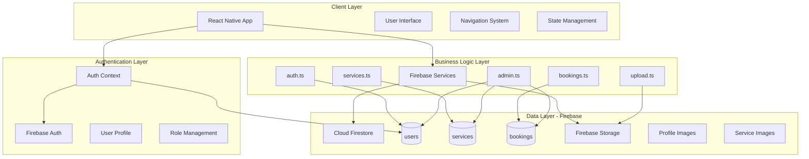
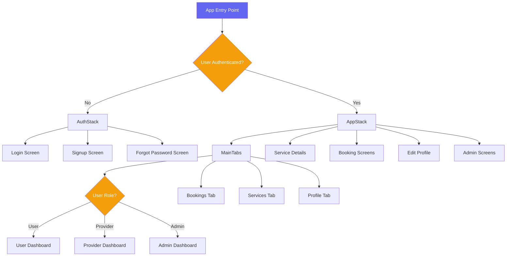
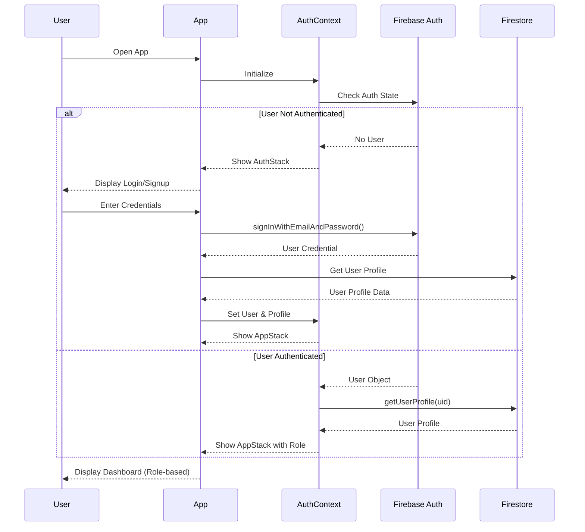
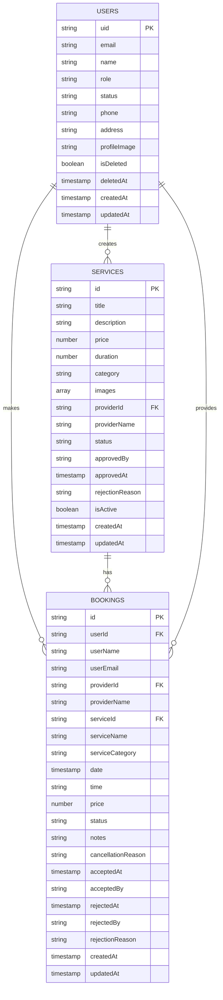
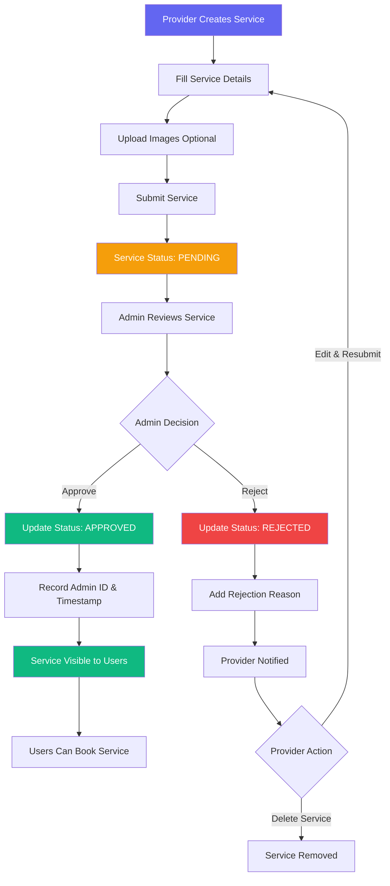
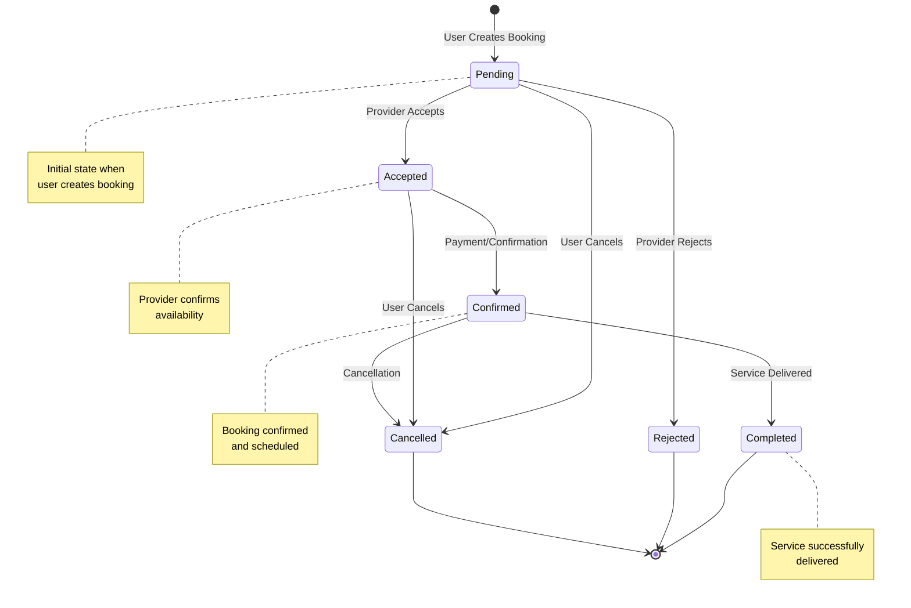
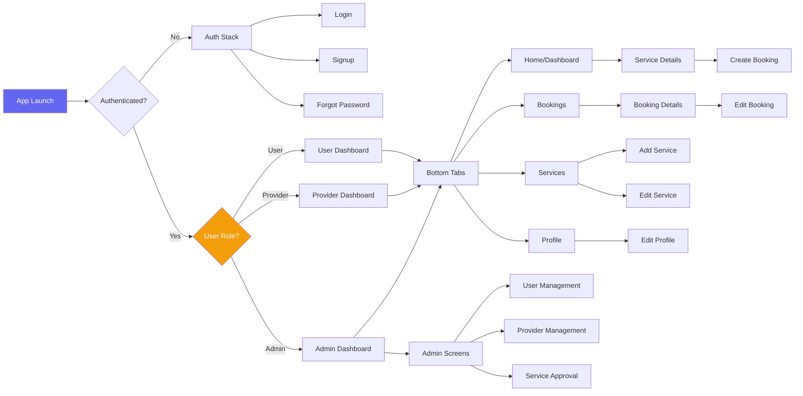

# Event Planner App - Technical Documentation

**Version:** 1.0.0  
**Last Updated:** November 27, 2025  
**Platform:** React Native (Expo)  
**Backend:** Firebase (Firestore, Authentication, Storage)

---

## Table of Contents

1. [Introduction & Overview](#1-introduction--overview)
2. [System Architecture](#2-system-architecture)
3. [Authentication & Authorization](#3-authentication--authorization)
4. [Core Features](#4-core-features)
5. [Data Models & Firebase Integration](#5-data-models--firebase-integration)
6. [Workflows & Processes](#6-workflows--processes)
7. [UI/UX Architecture](#7-uiux-architecture)
8. [Deployment & Configuration](#8-deployment--configuration)

---

## 1. Introduction & Overview

### 1.1 Purpose

The **Event Planner App** connects event service providers with customers, facilitating service discovery, booking management, and platform administration.

### 1.2 Key Features

- **Multi-Role System**: Admin, Provider, and User roles with distinct capabilities
- **Service Management**: Provider service creation with admin approval workflow
- **Booking System**: Complete booking lifecycle management
- **Real-time Updates**: Live data synchronization via Firebase
- **Admin Panel**: Comprehensive analytics and platform oversight

### 1.3 Technology Stack

| Layer          | Technology                          | Purpose                           |
| -------------- | ----------------------------------- | --------------------------------- |
| **Frontend**   | React Native 0.81.5 + Expo ~54.0.25 | Mobile application framework      |
| **Navigation** | React Navigation 7.x                | Screen navigation and routing     |
| **Styling**    | NativeWind 4.2.1                    | TailwindCSS for React Native      |
| **State**      | React Context API                   | Global state management           |
| **Backend**    | Firebase 12.6.0                     | Authentication, database, storage |
| **Database**   | Cloud Firestore                     | NoSQL real-time database          |
| **Language**   | TypeScript 5.9.2                    | Type-safe development             |

### 1.4 User Roles

| Role         | Key Capabilities                                   |
| ------------ | -------------------------------------------------- |
| **User**     | Browse services, create bookings, manage profile   |
| **Provider** | Create services, manage bookings, view analytics   |
| **Admin**    | Approve services, manage users, platform analytics |

---

## 2. System Architecture

### 2.1 High-Level Architecture



### 2.2 Project Structure

```
Event-Planner-App/
├── src/
│   ├── components/          # Reusable UI components
│   │   ├── buttons/         # Button components
│   │   ├── cards/           # Card components (Service, Booking, User)
│   │   ├── common/          # Common components (FormInput, SearchBar)
│   │   └── ui/              # UI utilities (Loader, Modal, EmptyState)
│   ├── constants/           # App constants and theme
│   ├── context/             # React Context (AuthContext)
│   ├── firebase/            # Firebase integration
│   │   ├── config.ts        # Firebase configuration
│   │   ├── auth.ts          # Authentication operations
│   │   ├── services.ts      # Service CRUD operations
│   │   ├── bookings.ts      # Booking management
│   │   ├── admin.ts         # Admin operations
│   │   └── upload.ts        # File upload utilities
│   ├── navigation/          # Navigation configuration
│   │   ├── RootNavigator.tsx
│   │   ├── AuthStack.tsx
│   │   ├── AppStack.tsx
│   │   └── Tabs.tsx
│   ├── screens/             # Screen components
│   │   ├── admin/           # Admin screens
│   │   ├── auth/            # Authentication screens
│   │   ├── bookings/        # Booking screens
│   │   ├── provider/        # Provider screens
│   │   ├── services/        # Service screens
│   │   ├── profile/         # Profile screens
│   │   └── home/            # Home screen
│   ├── types/               # TypeScript definitions
│   └── utils/               # Utility functions
├── App.tsx                  # Root component
├── firestore.rules          # Firestore security rules
└── package.json             # Dependencies
```

### 2.3 Navigation Architecture



---

## 3. Authentication & Authorization

### 3.1 Authentication Flow



### 3.2 Role-Based Access Control

| Feature                | User | Provider | Admin    |
| ---------------------- | ---- | -------- | -------- |
| Browse Services        | ✅   | ✅       | ✅       |
| Create Bookings        | ✅   | ❌       | ✅       |
| Create Services        | ❌   | ✅       | ✅       |
| Approve Services       | ❌   | ❌       | ✅       |
| Manage Users           | ❌   | ❌       | ✅       |
| View Analytics         | ❌   | ✅ (Own) | ✅ (All) |
| Accept/Reject Bookings | ❌   | ✅ (Own) | ✅       |

### 3.3 Firebase Security Rules

**Key Rules:**

- Users can read their own profile; admins can read all profiles
- Only admins can modify user roles
- Services are publicly readable
- Only providers and admins can create services
- Bookings are readable by involved parties (user, provider, admin)

---

## 4. Core Features

### 4.1 User Features

**Service Browsing:**

- View all approved services
- Filter by category (Event Planner, Photographer, Caterer, Decorator, Venue)
- Search by title or description
- View detailed service information

**Booking Management:**

- Create bookings with date, time, and notes
- View booking history with status indicators
- Edit pending bookings
- Cancel bookings with reason
- Track status: pending → accepted → confirmed → completed

### 4.2 Provider Features

**Service Management:**

- Create services with title, description, price, duration, category
- Upload multiple service images
- Services require admin approval (pending → approved/rejected)
- Edit and manage existing services

**Booking Management:**

- View incoming booking requests
- Accept or reject bookings with optional reason
- Track booking status and customer information
- Auto-update past bookings

**Provider Dashboard:**

- Total services (with approval status breakdown)
- Total bookings and pending jobs
- Earnings analytics
- Recent bookings and service performance

### 4.3 Admin Features

**User Management:**

- View all users with pagination and role filtering
- Edit user profiles and change roles
- Block/unblock users
- Soft delete user accounts

**Service Approval:**

- Review pending services
- Approve services (set status, record admin ID and timestamp)
- Reject services with reason
- Monitor all platform services

**Platform Analytics:**

- User metrics (total users by role)
- Service metrics (total, approved, pending, rejected)
- Booking metrics (total, by status)
- Real-time platform monitoring

---

## 5. Data Models & Firebase Integration

### 5.1 Firestore Collections



### 5.2 Core Data Types

**User Profile:**

```typescript
type UserRole = "admin" | "user" | "provider";
type UserStatus = "active" | "blocked";

interface UserProfile {
  uid: string;
  email: string;
  name: string;
  role: UserRole;
  status?: UserStatus;
  phone?: string;
  address?: string;
  profileImage?: string;
  isDeleted?: boolean;
  createdAt: Date;
  updatedAt: Date;
}
```

**Service:**

```typescript
type ServiceStatus = "pending" | "approved" | "rejected";

interface Service {
  id?: string;
  title: string;
  description: string;
  price: number;
  duration: number;
  category: string;
  images?: string[];
  providerId: string;
  providerName: string;
  status: ServiceStatus;
  approvedBy?: string;
  approvedAt?: Date;
  rejectionReason?: string;
  isActive: boolean;
  createdAt: Date;
  updatedAt: Date;
}
```

**Booking:**

```typescript
type BookingStatus =
  | "pending"
  | "accepted"
  | "confirmed"
  | "rejected"
  | "completed"
  | "cancelled";

interface Booking {
  id: string;
  userId: string;
  userName: string;
  providerId: string;
  providerName: string;
  serviceId: string;
  serviceName: string;
  date: Date;
  time: string;
  price: number;
  status: BookingStatus;
  notes?: string;
  cancellationReason?: string;
  createdAt: Date;
  updatedAt: Date;
}
```

### 5.3 Firebase Services

| Service         | Key Functions                                                                                               |
| --------------- | ----------------------------------------------------------------------------------------------------------- |
| **auth.ts**     | signup, login, logout, resetPassword, getUserProfile, updateUserProfile                                     |
| **services.ts** | getAllServices, getActiveServices, createService, updateService, deleteService, subscribeToServices         |
| **bookings.ts** | createBooking, updateBooking, cancelBooking, acceptBooking, rejectBooking, getBookings, subscribeToBookings |
| **admin.ts**    | getAllUsers, getUsersByRole, updateUserRole, deleteUser, approveService, rejectService, getAnalytics        |
| **upload.ts**   | uploadImage, deleteImage (with compression and optimization)                                                |

---

## 6. Workflows & Processes

### 6.1 Service Creation and Approval Workflow



**Process:**

1. Provider creates service with details and optional images
2. Service enters 'pending' status (not visible to users)
3. Admin reviews and approves/rejects
4. Approved services become visible; rejected services notify provider with reason
5. Provider can edit and resubmit rejected services

### 6.2 Booking Lifecycle



**Status Transitions:**

- **PENDING**: Initial state, awaiting provider response
- **ACCEPTED**: Provider accepts, awaiting confirmation
- **CONFIRMED**: Booking confirmed and scheduled
- **REJECTED**: Provider rejects (terminal state)
- **COMPLETED**: Service delivered (terminal state)
- **CANCELLED**: User/admin cancels (terminal state)

**Auto-Update Logic:**

- Past 'pending' bookings → 'cancelled'
- Past 'confirmed' bookings → 'completed'

---

## 7. UI/UX Architecture

### 7.1 Screen Navigation Flow



### 7.2 Component Architecture

**Reusable Components:**

| Category         | Components                                        | Purpose                        |
| ---------------- | ------------------------------------------------- | ------------------------------ |
| **Cards**        | ServiceCard, BookingCard, UserCard, StatCard      | Display structured information |
| **Inputs**       | FormInput, TextInputField, SearchInput, IconInput | User input collection          |
| **Buttons**      | PrimaryButton, SecondaryButton                    | Action triggers                |
| **UI Utilities** | Loader, EmptyState, ModalWrapper                  | Common UI patterns             |
| **Common**       | SearchBar, LoadingState, ActionCard               | Shared functionality           |

**Design Patterns:**

- **Container/Presentational**: Screens handle logic, components are pure UI
- **Context Pattern**: AuthContext for global state
- **Composition**: Complex UIs built from simple components

### 7.3 Styling with NativeWind

**Approach:** TailwindCSS utility classes for React Native

- Rapid development with utility-first CSS
- Consistent design system
- Responsive design support
- Easy theme customization

---

## 8. Deployment & Configuration

### 8.1 Firebase Setup

**Steps:**

1. Create Firebase project in Firebase Console
2. Enable Authentication (Email/Password provider)
3. Create Firestore database
4. Enable Firebase Storage
5. Copy configuration to `src/firebase/config.ts`
6. Deploy security rules from `firestore.rules`

### 8.2 Development

```bash
# Install dependencies
npm install

# Start development server
npx expo start

# Run on specific platform
npx expo start --android
npx expo start --ios
```

### 8.3 Production Build

```bash
# Build for Android
eas build --platform android

# Build for iOS
eas build --platform ios

# Build for both platforms
eas build --platform all
```

### 8.4 Best Practices

**Security:**

- Enforce Firestore security rules server-side
- Validate all user inputs
- Restrict file types and sizes for uploads
- Never commit API keys to version control
- Verify user roles server-side

**Performance:**

- Implement pagination for large lists
- Use real-time listeners sparingly
- Compress images before upload
- Leverage Firestore offline persistence
- Lazy load screens and components

---

## Conclusion

The Event Planner App provides a comprehensive platform connecting service providers with customers in the event planning industry.

**Key Strengths:**

- Role-based access control with clear separation
- Real-time data synchronization
- Comprehensive admin controls
- Intuitive user interfaces
- Robust booking management
- Secure Firebase integration

**Future Enhancements:**

- Push notifications for booking updates
- In-app messaging
- Payment integration
- Review and rating system
- Advanced search and filtering
- Provider analytics dashboard
- Multi-language support

---

**Document Version:** 1.0.0  
**Last Updated:** November 27, 2025  
**Maintained By:** Development Team
